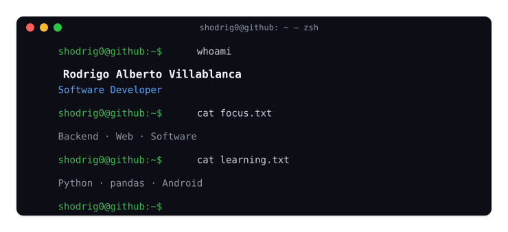

## System profile

  

## Service toolkit

  

## Selected projects
**[ScanApp-TK](https://github.com/shodrig0/ScanApp-TK)**  
Android POS prototype · Kotlin · PostgreSQL  
Independent project

**[Python Backend](https://github.com/shodrig0/python-backend)**  
Backend experiments · Python · FastAPI · PostgreSQL  
Personal project

**[Bugged Night Blog](https://github.com/shodrig0/bugged-night-blog)**  
React SPA · TypeScript · Cosmic CMS  
University team project

**[PWA-TP2](https://github.com/shodrig0/PWA-TP2)**  
Progressive Web App · React · JavaScript  
University team project

## Open a channel

  <a href="https://shodrig0.vercel.app/">Portfolio</a>
  &nbsp;·&nbsp;
  <a href="https://github.com/shodrig0">GitHub</a>

